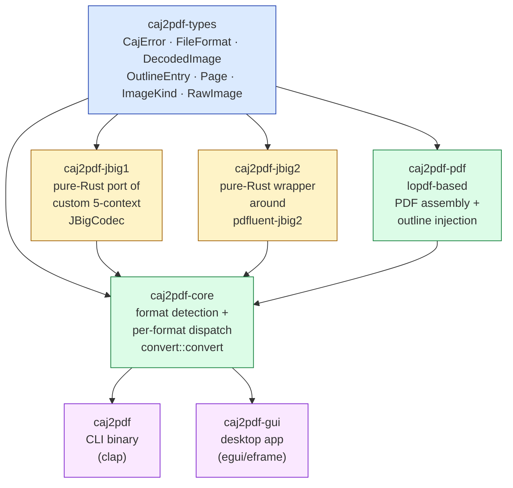
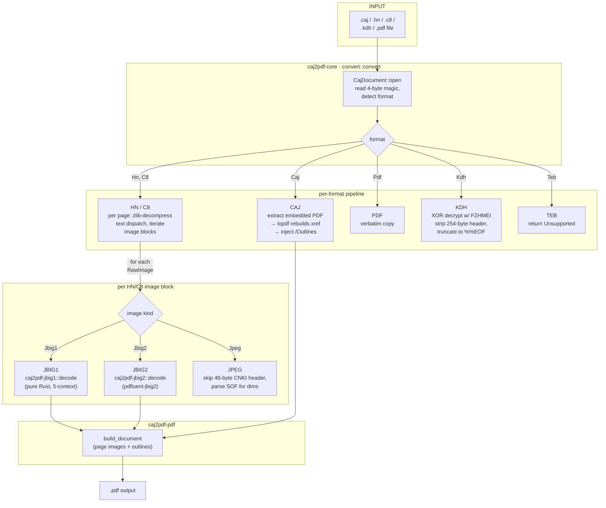

# Architecture

This document describes the module-level architecture of `caj2pdf-rs`.
For the byte-level layout of every supported file format, see
[`format-analysis.md`](format-analysis.md). For the JBIG1 decoder's
design rationale, see [`jbig1-reverse-notes.md`](jbig1-reverse-notes.md).

## Crate dependency graph



**Layering** (top-down):

1. **`caj2pdf-types`** — pure data types. No I/O, no logic, no deps. The
   leaf crate that every other crate depends on. Created when the
   pipeline moved into `core` to break a `pdf → core → pdf` cycle.
2. **`caj2pdf-jbig1` / `caj2pdf-jbig2`** — codec libraries, each with a
   single `decode(&[u8], u32, u32) → Bitmap` entry point. JBIG1 is a
   custom 5-context arithmetic coder ported from `JBigDecode.cc`;
   JBIG2 delegates to `pdfluent-jbig2`. Both return a 1-bpp `Bitmap`.
3. **`caj2pdf-pdf`** — lopdf-based PDF builder. Two entry points:
   `build_document(pages, outlines) → Vec<u8>` (assemble a fresh PDF)
   and `inject_outlines(bytes, outlines) → Vec<u8>` (add outlines to an
   existing PDF; also rebuilds the xref).
4. **`caj2pdf-core`** — the orchestrator. Owns `CajDocument` (a handle
   to an opened file with cached format/page count/TOC/layout) and
   `convert::convert` (the single high-level entry point called by
   every front-end).
5. **`caj2pdf` / `caj2pdf-gui`** — front-ends. CLI is a thin clap
   shim; GUI is egui/eframe with drag-drop and a worker thread pool.

The DAG is acyclic: every edge points upward, no crate depends on
a front-end, and the only "interesting" dependency is that
`caj2pdf-core` pulls in **all** the codec + PDF crates so its
`convert::convert` can dispatch on every format.

## End-to-end data flow



### Format-specific paths

| Format | Path | Work done |
|---|---|---|
| **CAJ** | `extract_pdf` → `lopdf` xref repair → `inject_outlines` → write | The embedded PDF is missing a `/Catalog` and `/Pages`; lopdf rebuilds the xref and we add the outline tree. |
| **HN / C8** | `iter_pages` → per page: `zlib::decode` (text) + per `RawImage`: `decode_image` (JBIG1/2/JPEG) → `build_document` → `inject_outlines` | The only branch that actually decodes image blocks. |
| **PDF** | `std::fs::copy` | Pass-through. |
| **KDH** | XOR-decrypt with `FZHMEI`, drop 254-byte header, truncate at `%%EOF` | The decrypted bytes are a complete PDF (typically PDF 1.5+ with a cross-reference stream). |
| **TEB** | `Err(CajError::Unsupported("TEB is not yet implemented"))` | Detected but not converted. |

### `convert::convert` — the single front-end entry point

```rust
// crates/core/src/convert.rs:33
pub fn convert(input: &Path, output: &Path) -> CajResult<()> {
    let doc = CajDocument::open(input)?;
    match doc.format() {
        FileFormat::Caj => convert_caj(&doc, output),
        FileFormat::Hn | FileFormat::C8 => convert_hn(&doc, output),
        FileFormat::Pdf => convert_pdf(&doc, output),
        FileFormat::Kdh => convert_kdh(&doc, output),
        FileFormat::Teb => Err(CajError::Unsupported(
            "TEB format is not yet implemented",
        )),
    }
}
```

Both `caj2pdf` (CLI) and `caj2pdf-gui` (desktop app) call this
exact function. The CLI wraps it in `anyhow::Result`, the GUI in
`anyhow::Error::new` for `?` propagation.

## Crate-by-crate public API

| Crate | Public surface |
|---|---|
| `caj2pdf-types` | `CajError`, `CajResult`, `FileFormat`, `OutlineEntry`, `Page`, `ImageKind`, `RawImage`, `DecodedImage` |
| `caj2pdf-jbig1` | `decode(&[u8], u32, u32) -> JbigResult<Bitmap>`, `Bitmap` (1-bpp, MSB-first) |
| `caj2pdf-jbig2` | `decode(&[u8], u32, u32) -> Jbig2Result<Bitmap>` (delegates to `pdfluent-jbig2`) |
| `caj2pdf-pdf` | `build_document(&[PageInput], &[OutlineEntry]) -> PdfResult<Vec<u8>>`, `inject_outlines(&[u8], &[OutlineEntry]) -> PdfResult<Vec<u8>>`, `PageInput` |
| `caj2pdf-core` | `CajDocument::open`, `format`, `page_count`, `toc`, `pages`, `extract_pdf`, `convert::convert`, `convert::decrypt_kdh` |
| `caj2pdf` (CLI) | binary only — `caj2pdf show\|convert\|outlines\|text-extract\|parse <file>` |
| `caj2pdf-gui` | binary only — egui window, drag-drop, single-click convert |

## Error handling

* Every library crate defines its own `*Error` enum with `thiserror`.
* `caj2pdf-core` exports `CajError` as the canonical error type.
* `caj2pdf-pdf` and `caj2pdf-jbigN` convert their internal errors
  into `CajError::Malformed { format, message }` so front-ends only
  need to handle one error type.
* `cli::main` and `gui::App` use `anyhow::Result` at the boundary and
  convert with `?` / `anyhow::Error::new` / `.context()`.

## Threading

* `convert::convert` is **single-threaded** (CPU-bound, runs on the
  calling thread).
* The **CLI** runs it on the main thread — fine for a CLI.
* The **GUI** runs it on a `std::thread` per pending file, with an
  `mpsc::channel` for status updates. The UI polls the channel at
  every frame and calls `ctx.request_repaint()` from the worker.
* Decoders (`jbig1::decode`, `jbig2::decode`) are pure functions
  safe to call from any thread.

## Testing strategy

* **Unit tests** in each crate test the public API against synthetic
  inputs (constructed headers, hand-crafted JBIG1 patterns, decrypt
  round-trips, etc.).
* **Integration tests** in `crates/*/tests/*.rs` test cross-crate
  flows (`end_to_end` in `cli/tests/` spawns the actual binary and
  asserts the output PDF).
* **Headless GUI tests** in `crates/gui/src/font.rs` test the CJK
  font loader.
* **End-to-end with real files** requires actual CNKI files (not
  shipped; see `docs/development.md`).

## Logging

All crates use `tracing`. The CLI / GUI initialize
`tracing-subscriber` with `EnvFilter::new("info")` (override with
`RUST_LOG=caj2pdf=debug`). Per-page progress is logged at
`info`; JBIG decoder warnings at `warn`.

## Why this layout?

* **`caj2pdf-types` is a leaf crate** because `caj2pdf-pdf` needs
  the data types (`DecodedImage`, `OutlineEntry`) and
  `caj2pdf-core` needs the PDF assembly. Lifting the types into a
  third crate breaks the `pdf → core → pdf` cycle.
* **`jbig1` and `jbig2` are separate crates** because they have
  radically different histories (one is a custom port of
  `JBigDecode.cc`, the other delegates to `pdfluent-jbig2`). A
  consumer that only needs one codec doesn't pay the cost of the
  other.
* **`pdf` is a separate crate** so it can be reused independently
  — e.g. by a future "build PDF from image folder" tool.
* **`core` holds the entire conversion pipeline** so that the GUI
  and CLI share one implementation. Without this, the GUI would
  have to depend on the CLI crate, creating a cycle.
* **CLI and GUI are sibling front-ends**, each thin and replaceable.
  A future MCP server, FFI library, or web service would slot in
  next to them and call `core::convert::convert` directly.
